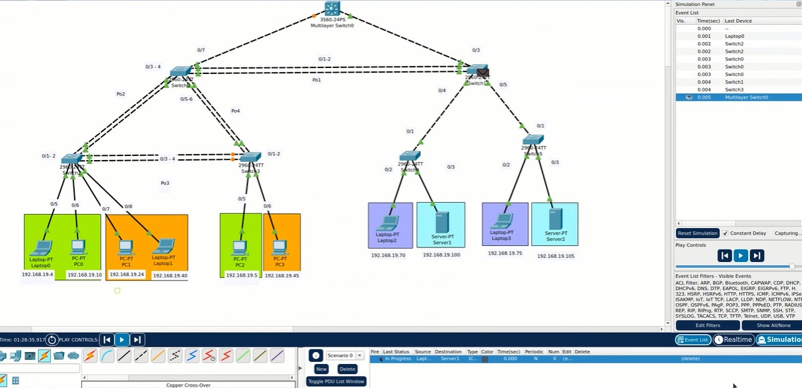
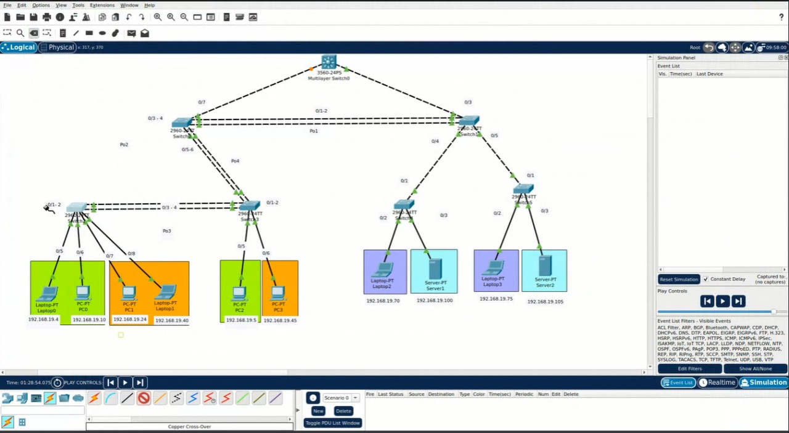

### Universidad de San Carlos de Guatemala

### Facultad de Ingeniería

### Escuela de Ciencias y Sistemas

## Practica 1

<div>
    <p align="center">
        
  <p>
</div>

## Curso: Redes de Computadoras 2

<hr>
<br>
<div>
    <table>
        <tr>
            <th>Nombre</th>
            <th>Carnet</th>
        </tr>
        <tr>
            <th>Juan Antonio Solares Samayoa</th>
            <th>201800496</th>
        </tr>
        <tr>
            <th>Elmer Gustavo Sánchez García</th>
            <th>201801351</th>
        </tr>
        <tr>
            <th>Cristian Alexander Gómez Guzmán</th>
            <th>201801480</th>
        </tr>
    </table>
</div>
<br>
<hr>

# Commands

### Switch Capa 3

```
**nota: Por defecto ya esta habilitados los puertos en modo truncal**

config t
vlan 19
name ventas
exit

vlan 29
name distribucion
exit

vlan 39
name administracion
exit

vlan 49
name servidores
exit

vlan 99
name management&native
exit

vlan 999
name blackhole
exit

VTP:
conf t
vtp domain g9
vtp password g9
vtp mode server
vtp version 2

INTER VLAN:

conf t
interface vlan 19
ip add 192.168.19.1 255.255.255.224
no shutdown
exit

interface vlan 29
ip add 192.168.19.33 255.255.255.224
no shutdown
exit

interface vlan 39
ip add 192.168.19.65 255.255.255.224
no shutdown
exit

interface vlan 49
ip add 192.168.19.97 255.255.255.224
no shutdown
exit

config t
ip routing

```

### SWITCH S0:

```

TRUNCALES:

config t
int f0/7
switchport mode trunk
switchport trunk allowed vlan 1,19,29,39,49,99,999,1002-1005

config t
int range f0/1 - 6
switchport mode trunk
switchport trunk allowed vlan 1,19,29,39,49,99,999,1002-1005

VTP:
conf t
vtp domain g9
vtp password g9
vtp mode client

PORT CHANEL:
LACP:
conf t
int range f0/1 - 2
channel-protocol lacp
channel-group 1 mode active
exit

int range f0/3 - 4
channel-protocol lacp
channel-group 2 mode active
exit

int range f0/5 - 6
channel-protocol lacp
channel-group 4 mode active
exit

PAGP:
conf t
int range f#/# - # || int f#/#
channel-protocol pagp
channel-group <no> mode on <auto || desirable>
exit
```

### SWITCH S1:

```
config t
int range f0/1 - 5
switchport mode trunk
switchport trunk allowed vlan 1,19,29,39,49,99,999,1002-1005

VTP:
conf t
vtp domain g9
vtp password g9
vtp mode client

PORT CHANEL:
LACP:
conf t
int range f0/1 - 2
channel-protocol lacp
channel-group 1 mode active
exit

```

### SWITCH S2 - S3:

```
config t
int range f0/1 - 4
switchport mode trunk
switchport trunk allowed vlan 1,19,29,39,49,99,999,1002-1005

VTP:
conf t
vtp domain g9
vtp password g9
vtp mode client

PORT CHANEL S2:
LACP:
conf t
int range f0/1 - 

int range f0/3 - 4
channel-protocol lacp
channel-group 3 mode active
exit

PORT CHANEL S3:
LACP:
conf t
int range f0/1 - 2
channel-protocol lacp
channel-group 4 mode active
exit

int range f0/3 - 4
channel-protocol lacp
channel-group 3 mode active
exit

MODO ACCESO S2

- VENTAS y DISTRIBUCIÓN

config t
interface range f0/5 - 6
switchport mode access
switchport access vlan 19
exit

interface range f0/7 - 8
switchport mode access
switchport access vlan 29
exit

MODO ACCESO S3

- VENTAS y DISTRIBUCIÓN

config t
interface f0/5
switchport mode access
switchport access vlan 19
exit

interface f0/6
switchport mode access
switchport access vlan 29
exit

```

### SWITCH S4 - S5:

```

config t
int f0/1
switchport mode trunk
switchport trunk allowed vlan 1,19,29,39,49,99,999,1002-1005

VTP:
conf t
vtp domain g9
vtp password g9
vtp mode client

MODO ACCESO S4

- ADMINISTRACIÓN y SERVIDORES

config t
interface f0/2
switchport mode access
switchport access vlan 39
exit

interface f0/3
switchport mode access
switchport access vlan 49
interface range f0/7 - 8
switchport mode access
switchport access vlan 29
exit

MODO ACCESO S3

- VENTAS y DISTRIBUCIÓN

config t
interface f0/5
switchport mode access
switchport access vlan 19
exit


MODO ACCESO S5

- ADMINISTRACIÓN y SERVIDORES

config t
interface f0/2
switchport mode access
switchport access vlan 39
exit

interface f0/3
switchport mode access
switchport access vlan 49
exit
```

### STP de

```
config t
spanning-tree mode rapid-pvst

```

## Seguridad de interfaces de red

### SWITCH CAPA 3

config t
int range f0/3 - 24
switchport mode access
switchport access vlan 999
exit

config t
int range f0/1 - 2
switchport trunk native vlan 99
exit

### SWITCH 0

config t
int range f0/8 - 24
switchport mode access
switchport access vlan 999
exit

config t
int range f0/1 - 7
switchport trunk native vlan 99
exit

### SWITCH 1

config t
int range f0/6 - 24
switchport mode access
switchport access vlan 999
exit

config t
int range f0/1 - 5
switchport trunk native vlan 99
exit

### SWITCH 2

config t
int range f0/9 - 24
switchport mode access
switchport access vlan 999
exit

config t
int range f0/1 - 4
switchport trunk native vlan 99
exit

config t
int range f0/5 - 6
switchport port-security
switchport port-security maximum 5
switchport port-security violation shutdown
exit

config t
int range f0/7 - 8
switchport port-security
switchport port-security maximum 1
switchport port-security mac-address sticky switchport port-security violation shutdown
exit

### SWITCH 3

config t
int range f0/7 - 24
switchport mode access
switchport access vlan 999
exit

config t
int range f0/1 - 4
switchport trunk native vlan 99
exit

config t
int f0/5
switchport port-security
switchport port-security maximum 5
switchport port-security violation shutdown
exit

config t
int f0/6
switchport port-security
switchport port-security maximum 1
switchport port-security mac-address sticky switchport port-security violation shutdown
exit

### SWITCH 4

config t
int range f0/4 - 24
switchport mode access
switchport access vlan 999
exit

config t
int f0/1
switchport trunk native vlan 99
exit

config t
int f0/2
switchport port-security
switchport port-security maximum 5
switchport port-security violation shutdown
exit

### SWITCH 5

config t
int range f0/4 - 24
switchport mode access
switchport access vlan 999
exit

config t
int f0/1
switchport trunk native vlan 99
exit

config t
int f0/2
switchport port-security
switchport port-security maximum 5
switchport port-security violation shutdown
exit

sh int f0/1 sw


<hr>

# Pruebas de convergencia 

| Escenario | Tipo Ethernet Channel | Protocolo Spanning-Tree | Convergencia (s) |
| --------- | --------------------- | ----------------------- | ---------------- |
| 1         | Ethernet Channel LACP | PVST                    | 50               |
| 2         | Ethernet Channel LACP | Rapid PVST              | 2.811            |
| 3         | Ethernet Channel PAgP | PVST                    | 65.4             |
| 4         | Ethernet Channel PAgP | Rapid PVST              | 6.01             |


<div>
    <p align="center">
        
  <p>
</div>

<br>

<div>
    <p align="center">
        
  <p>
</div>
<hr>