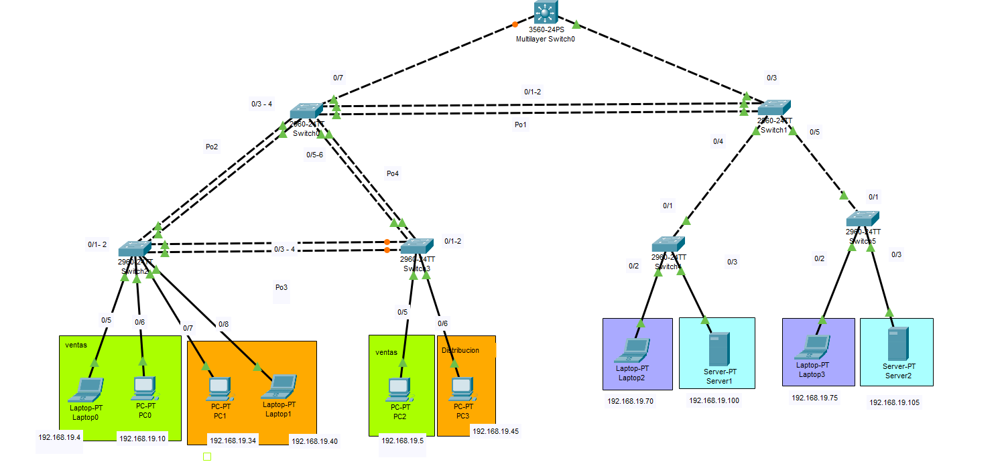

### Universidad de San Carlos de Guatemala

### Facultad de Ingeniería

### Escuela de Ciencias y Sistemas

## Practica 1

<div>
    <p align="center">
        
  <p>
</div>

## Curso: Redes de Computadoras 2

<hr>
<br>
<div>
    <table>
        <tr>
            <th>Nombre</th>
            <th>Carnet</th>
        </tr>
        <tr>
            <th>Juan Antonio Solares Samayoa</th>
            <th>201800496</th>
        </tr>
        <tr>
            <th>Elmer Gustavo Sánchez García</th>
            <th>201801351</th>
        </tr>
        <tr>
            <th>Cristian Alexander Gómez Guzmán</th>
            <th>201801480</th>
        </tr>
    </table>
</div>
<br>
<hr>


# Topología 




# VTP

<div>
    <table>
        <thead>
        <tr>
            <th>DOMINIO</th>
            <th>PASSWORD</th>
        </tr>
        </thead>
        <tbody>
            <tr>
                <th>g9</th>
                <th>g9</th>  
            </tr>
        </tbody>
    </table>
</div>


# VTP

## Definición:
<p>
VTP son las siglas de VLAN Trunking Protocol, un protocolo de mensajes de nivel 2 usado para configurar y administrar VLANs en equipos Cisco. Permite centralizar y simplificar la administración en un domino de VLANs, pudiendo crear, borrar y renombrar las mismas, reduciendo así la necesidad de configurar la misma VLAN en todos los nodos. El protocolo VTP nace como una herramienta de administración para redes de cierto tamaño, donde la gestión manual se vuelve inabordable.
</p>

## Modos de VTP

* <b>Servidor</b>: Es el modo por defecto. Desde él se pueden crear, eliminar o modificar VLANs. Su cometido es anunciar su configuración al resto de switches del mismo dominio VTP y sincronizar dicha configuración con la de otros servidores, basándose en los mensajes VTP recibidos a través de sus enlaces trunk. Debe haber al menos un servidor. Se recomienda autenticación MD5.
  
* <b>Cliente</b>: En este modo no se pueden crear, eliminar o modificar VLANs, tan sólo sincronizar esta información basándose en los mensajes VTP recibidos de servidores en el propio dominio. Un cliente VTP sólo guarda la información de la VLAN para el dominio completo mientras el switch está activado. Un reinicio del switch borra la información de la VLAN.
  
* <b>Transparente</b>: Desde este modo tampoco se pueden crear, eliminar o modificar VLANs que afecten a los demás switches. La información VLAN en los switches que trabajen en este modo sólo se puede modificar localmente. Su nombre se debe a que no procesa las actualizaciones VTP recibidas, tan sólo las reenvía a los switches del mismo dominio


## Configuraciones VTP en la topologia

### Switches configurados VTP modo servidor
* S0 

### Switches configurados VTP modo cliente
* S1
* S2
* S3
* S4
* S5


# EXPLICACIÓN SUBNETTING 

## Tabla de subredes


| VLAN | Nombre            | Direccion de red    | Primera dirección asignable | Última dirección asignable | Dirección de broadcast | Mascara de subred |
| ---- | ----------------- | ------------------- | --------------------------- | -------------------------- | ---------------------- | ----------------- |
| 19   | Ventas            | 192.168.19.0 / 27   | 192.168.19.1                | 192.168.19.30              | 192.168.19.31          | 255.255.255.224   |
| 29   | Distribución      | 192.168.19.32 / 27  | 192.168.19.33               | 192.168.19.62              | 192.168.19.63          | 255.255.255.224   |
| 39   | Administración    | 192.168.19.64 / 27  | 192.168.19.65               | 192.168.19.94              | 192.168.19.95          | 255.255.255.224   |
| 49   | Servidores        | 192.168.19.96 / 27  | 192.168.19.97               | 192.168.19.126             | 192.168.19.127         | 255.255.255.224   |
| 99   | Management&Native | 192.168.19.128 / 27 | 192.168.19.129              | 192.168.19.158             | 192.168.19.159         | 255.255.255.224   |
| 999  | BlackHole         | 192.168.19.160 / 27 | 192.168.19.161              | 192.168.19.190             | 192.168.19.191         | 255.255.255.224   |

# VLANs UTILIZADAS

<div>
    <table>
        <tr>
            <th># VLAN</th>
            <td>NOMBRE</td>
        </tr>
        <tr>
            <th>Ventas</th>
            <td>19</td>
        </tr>
        <tr>
            <th>Distribución</th>
            <td>29</td>
        </tr>
        <tr>
            <th>Administración</th>
            <td>39</td>
        </tr>
        <tr>
            <th>Servidores</th>
            <td>49</td>
        </tr>
        <tr>
            <th>Management&Native</th>
            <td>99</td>
        </tr>
        <tr>
            <th>BlackHole</th>
            <td>999</td>
        </tr>
    </table>
</div>

# Comandos utilizados para realizar la práctica

### Switch Capa 3

```
**nota: Por defecto ya esta habilitados los puertos en modo truncal**

config t
vlan 19
name ventas
exit

vlan 29
name distribucion
exit

vlan 39
name administracion
exit

vlan 49
name servidores
exit

vlan 99
name management&native
exit

vlan 999
name blackhole
exit

VTP:
conf t
vtp domain g9
vtp password g9
vtp mode server
vtp version 2

INTER VLAN:

conf t
interface vlan 19
ip add 192.168.19.1 255.255.255.224
no shutdown
exit

interface vlan 29
ip add 192.168.19.33 255.255.255.224
no shutdown
exit

interface vlan 39
ip add 192.168.19.65 255.255.255.224
no shutdown
exit

interface vlan 49
ip add 192.168.19.97 255.255.255.224
no shutdown
exit

config t
ip routing

```

### SWITCH S0:

```

TRUNCALES:

config t
int f0/7
switchport mode trunk
switchport trunk allowed vlan 1,19,29,39,49,99,999,1002-1005

config t
int range f0/1 - 6
switchport mode trunk
switchport trunk allowed vlan 1,19,29,39,49,99,999,1002-1005

VTP:
conf t
vtp domain g9
vtp password g9
vtp mode client

PORT CHANEL:
LACP:
conf t
int range f0/1 - 2
channel-protocol lacp
channel-group 1 mode active
exit

int range f0/3 - 4
channel-protocol lacp
channel-group 2 mode active
exit

int range f0/5 - 6
channel-protocol lacp
channel-group 4 mode active
exit

PAGP:
conf t
int range f#/# - # || int f#/#
channel-protocol pagp
channel-group <no> mode on <auto || desirable>
exit
```

### SWITCH S1:

```
config t
int range f0/1 - 5
switchport mode trunk
switchport trunk allowed vlan 1,19,29,39,49,99,999,1002-1005

VTP:
conf t
vtp domain g9
vtp password g9
vtp mode client

PORT CHANEL:
LACP:
conf t
int range f0/1 - 2
channel-protocol lacp
channel-group 1 mode active
exit

```

### SWITCH S2 - S3:

```
config t
int range f0/1 - 4
switchport mode trunk
switchport trunk allowed vlan 1,19,29,39,49,99,999,1002-1005

VTP:
conf t
vtp domain g9
vtp password g9
vtp mode client

PORT CHANEL S2:
LACP:
conf t
int range f0/1 - 2
channel-protocol lacp
channel-group 2 mode active
exit

int range f0/3 - 4
channel-protocol lacp
channel-group 3 mode active
exit

PORT CHANEL S3:
LACP:
conf t
int range f0/1 - 2
channel-protocol lacp
channel-group 4 mode active
exit

int range f0/3 - 4
channel-protocol lacp
channel-group 3 mode active
exit

MODO ACCESO S2

- VENTAS y DISTRIBUCIÓN

config t
interface range f0/5 - 6
switchport mode access
switchport access vlan 19
exit

interface range f0/7 - 8
switchport mode access
switchport access vlan 29
exit

MODO ACCESO S3

- VENTAS y DISTRIBUCIÓN

config t
interface f0/5
switchport mode access
switchport access vlan 19
exit

interface f0/6
switchport mode access
switchport access vlan 29
exit

```

### SWITCH S4 - S5:

```

config t
int f0/1
switchport mode trunk
switchport trunk allowed vlan 1,19,29,39,49,99,999,1002-1005

VTP:
conf t
vtp domain g9
vtp password g9
vtp mode client

MODO ACCESO S4

- ADMINISTRACIÓN y SERVIDORES

config t
interface f0/2
switchport mode access
switchport access vlan 39
exit

interface f0/3
switchport mode access
switchport access vlan 49
interface range f0/7 - 8
switchport mode access
switchport access vlan 29
exit

MODO ACCESO S3

- VENTAS y DISTRIBUCIÓN

config t
interface f0/5
switchport mode access
switchport access vlan 19
exit


MODO ACCESO S5

- ADMINISTRACIÓN y SERVIDORES

config t
interface f0/2
switchport mode access
switchport access vlan 39
exit

interface f0/3
switchport mode access
switchport access vlan 49
exit
```

<!-- ### STP de

```
config t
spanning-tree mode rapid-pvst

``` -->

## Seguridad de interfaces de red

### SWITCH CAPA 3

config t
int range f0/3 - 24
switchport mode access
switchport access vlan 999
exit

config t
int range f0/1 - 2
switchport trunk native vlan 99
exit

### SWITCH 0

config t
int range f0/8 - 24
switchport mode access
switchport access vlan 999
exit

config t
int range f0/1 - 7
switchport trunk native vlan 99
exit

### SWITCH 1

config t
int range f0/6 - 24
switchport mode access
switchport access vlan 999
exit

config t
int range f0/1 - 5
switchport trunk native vlan 99
exit

### SWITCH 2

config t
int range f0/9 - 24
switchport mode access
switchport access vlan 999
exit

config t
int range f0/1 - 4
switchport trunk native vlan 99
exit

config t
int range f0/5 - 6
switchport port-security
switchport port-security maximum 5
switchport port-security violation shutdown
exit

config t
int range f0/7 - 8
switchport port-security
switchport port-security maximum 1
switchport port-security mac-address sticky switchport port-security violation shutdown
exit

### SWITCH 3

config t
int range f0/7 - 24
switchport mode access
switchport access vlan 999
exit

config t
int range f0/1 - 4
switchport trunk native vlan 99
exit

config t
int f0/5
switchport port-security
switchport port-security maximum 5
switchport port-security violation shutdown
exit

config t
int f0/6
switchport port-security
switchport port-security maximum 1
switchport port-security mac-address sticky switchport port-security violation shutdown
exit

### SWITCH 4

config t
int range f0/4 - 24
switchport mode access
switchport access vlan 999
exit

config t
int f0/1
switchport trunk native vlan 99
exit

config t
int f0/2
switchport port-security
switchport port-security maximum 5
switchport port-security violation shutdown
exit

### SWITCH 5

config t
int range f0/4 - 24
switchport mode access
switchport access vlan 999
exit

config t
int f0/1
switchport trunk native vlan 99
exit

config t
int f0/2
switchport port-security
switchport port-security maximum 5
switchport port-security violation shutdown
exit

sh int f0/1 sw


<hr>


# ESCENARIO DE MEJOR CONVERGENCIA

En la siguiente tabla se muestran los escenarios probados para verificar cual era el escenario que tiene un menor de convergencia al momento de desconectar alguna parte de de la topología.

Se examinaron 4 posibles escenarios:

| Escenario | Tipo Ethernet Channel | Protocolo Spanning-Tree | Convergencia (s) |
| --------- | --------------------- | ----------------------- | ---------------- |
| 1         | Ethernet Channel LACP | PVST                    | 50               |
| 2         | Ethernet Channel LACP | Rapid PVST              | 2.811            |
| 3         | Ethernet Channel PAgP | PVST                    | 65.4             |
| 4         | Ethernet Channel PAgP | Rapid PVST              | 6.01             |


<p>
De acuerdo a la tabla, el escenario que tardó menos tiempo en converger en la conexión fue el escenario # 2 que corresponde al Ethernet Channel LACP protocolo Spanning-Tree Rapid PVST, y el  escenario que tardo más tiempo en converger fue el escenario # 1 que corresponde al Ethernet Channel LACP y el protocolo de Spanning-Tree PVST. 
</p>

<p>
En el escenario con menor tiempo de convergencia se cuenta con el protocolo Rapid PVST, y este protocolo de Spanning Tree tiene como caracteristica que a comparación de otros otros protocolos Spanning Tree que se reduce significativamente el tiempo de convergencia de la topología, siendo este una evolución del estándar 
</p>

<p>
En el escenario con mayor tiempo de convergencia se cuena con el protocolo Per VLAN Spanning Tree, en donde se trata a cada VLAN como si fuera una red separada.
</p>

<div>
    <p align="center">
        
  <p>
</div>

<br>

<div>
    <p align="center">
        
  <p>
</div>
<hr>
