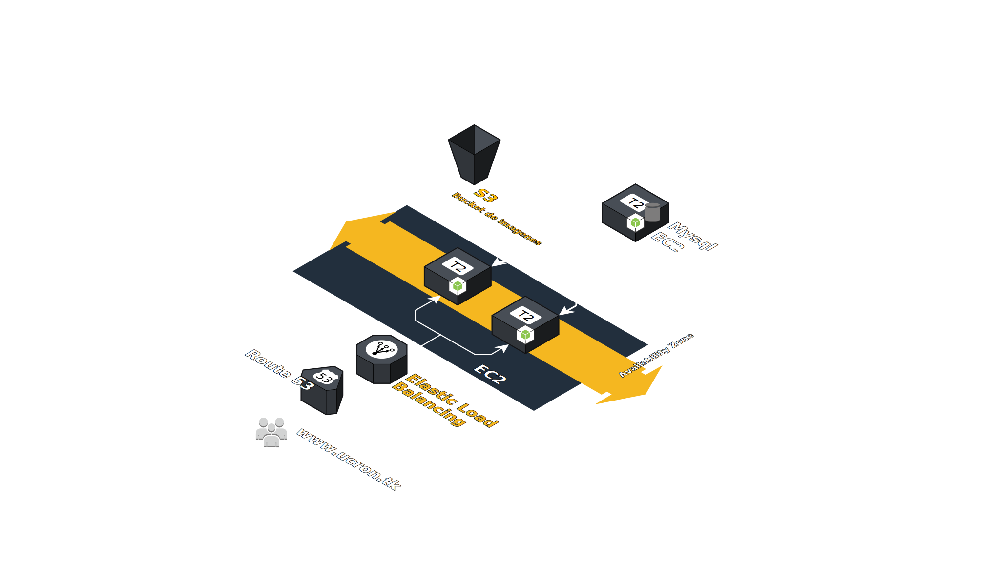
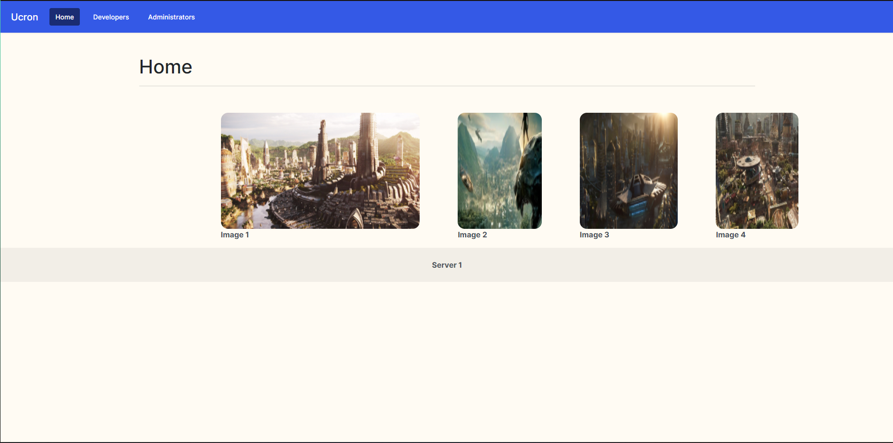

### Universidad de San Carlos de Guatemala

### Facultad de Ingeniería

### Escuela de Ciencias y Sistemas

## Proyecto 1

    

        
  

## Curso: Redes de Computadoras 2

 

    <table>
        <tr>
            <th>Nombre</th>
            <th>Carnet</th>
        </tr>
        <tr>
            <th>Juan Antonio Solares Samayoa</th>
            <th>201800496</th>
        </tr>
        <tr>
            <th>Elmer Gustavo Sánchez García</th>
            <th>201801351</th>
        </tr>
        <tr>
            <th>Cristian Alexander Gómez Guzmán</th>
            <th>201801480</th>
        </tr>
    </table>

 

# **Arquitectura**

    

        
  

# **Interfaz de la pagina web**

La interfaz gráfica de la aplicación fue desarrollada en ReactJS, la cual es una librería escrita en JavaScript de código abierto enfocada a la visualización para facilitar la creación de componentes interactivos y reutilizables para interfaces de usuario.  

Se eligió ReactJS sobre otras tecnologías por los siguientes beneficios:

1. Desarrollo Rentable.
2. Entrega más rapiuda de proyectos de aplicaciones.
3. Aprovecha Javascript.
4. Es codigo abierto.
5. Excelente rendimiento de la aplicación.
6. Permite un diseño por modulos.

# **Vista Home**

En la vista Home se muestran un Carrusel de imagenes los cuales muestan lugares turisticos de Ucron. 

    

        
    

# **Vista Developers**

En la vista developers de muestran los datos de los desarrolladores que realizaron la aplicación.

    

        
    

# **Vista Administrators**

En la vista Administrators se muestran una corta biografía de personas importantes de Ucron.  

    

        
    

# **Load balancer**

    

        
  

# **Target group**

    

        
  

    

        
  

