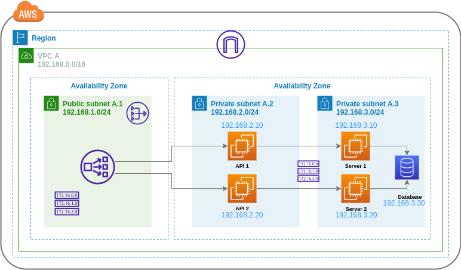
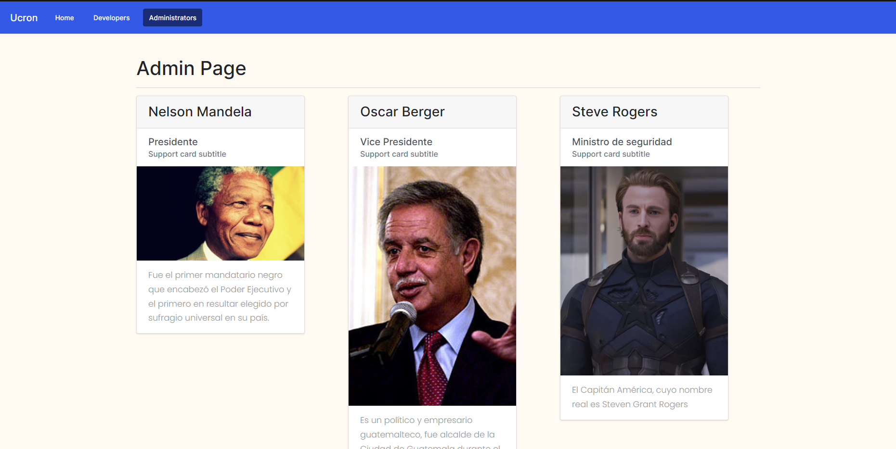

### Universidad de San Carlos de Guatemala

### Facultad de Ingeniería

### Escuela de Ciencias y Sistemas

## Proyecto 1

    

        
  

## Curso: Redes de Computadoras 2

 

    <table>
        <tr>
            <th>Nombre</th>
            <th>Carnet</th>
        </tr>
        <tr>
            <th>Juan Antonio Solares Samayoa</th>
            <th>201800496</th>
        </tr>
        <tr>
            <th>Elmer Gustavo Sánchez García</th>
            <th>201801351</th>
        </tr>
        <tr>
            <th>Cristian Alexander Gómez Guzmán</th>
            <th>201801480</th>
        </tr>
    </table>

 

# **Arquitectura**

    

        
    

# **Vista Home**

En la vista Home se muestran un Carrusel de imagenes los cuales muestan lugares turisticos de Ucron. 

    

        
    

# **Vista Developers**

En la vista developers de muestran los datos de los desarrolladores que realizaron la aplicación.

    

        
    

# **Vista Administrators**

En la vista Administrators se muestran una corta biografía de personas importantes de Ucron.  

    

        
    

# **Servidor**
El servidor de la aplicación fue desarrollada en Node JS, Node es un entorno en tiempo de ejecución multi plataforma, para la capa de servidor basado en el lenguaje de programación JavaScript.

Base de datos 
La base de datos que se utilizo fue MySQL, este es un sistema de gestión de base de datos relacional esta considerado como la base de datos de código abierto mas popular del mundo.
