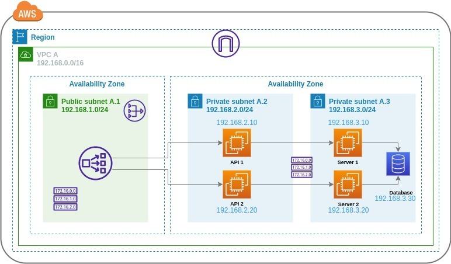

### Universidad de San Carlos de Guatemala

### Facultad de Ingeniería

### Escuela de Ciencias y Sistemas

## Proyecto 2

    

        
  

## Curso: Redes de Computadoras 2

 

    <table>
        <tr>
            <th>Nombre</th>
            <th>Carnet</th>
        </tr>
        <tr>
            <th>Juan Antonio Solares Samayoa</th>
            <th>201800496</th>
        </tr>
        <tr>
            <th>Elmer Gustavo Sánchez García</th>
            <th>201801351</th>
        </tr>
        <tr>
            <th>Cristian Alexander Gómez Guzmán</th>
            <th>201801480</th>
        </tr>
    </table>

 

## Manual tecnico

### Contenido

- [Manual tecnico](#manual-tecnico)
  - [Arquitectura](#arquitectura)
  - [VPC](#vpc)
  - [LOAD BALANCER](#load-balancer)
  - [NAT](#nat-gateways)
  <!-- - [Seguridad](#seguiridad) -->

### **Arquitectura**

  

     
  

### **VPC**

Es un servicio que permite lanzar recursos de AWS en una red virtual aislada de forma lógica que usted defina. Puede controlar todos los aspectos del entorno de red virtual, como la selección de su propio rango de direcciones IP, la creación de subredes y la configuración de tablas de enrutamiento y gateways de red. Puede utilizar tanto IPv4 como IPv6 para la mayoría de los recursos de la VPC, lo que ayuda a garantizar el acceso seguro y fácil a los recursos y las aplicaciones.

Dirección VPC A

**192.168.1.0**

**255.255.0.0**

|    **IP**    |   **Nombre**  |  **Subred** |  **Mascara**  | **Tipo** |
|:------------:|:-------------:|:-----------:|:-------------:|:--------:|
| 192.168.2.10 |     API 1     | 192.168.2.0 | 255.255.255.0 |  PRIVATE |
| 192.168.2.20 |     API 2     | 192.168.2.0 | 255.255.255.0 |  PRIVATE |
| 192.168.3.10 |    SERVER 1   | 192.168.3.0 | 255.255.255.0 |  PRIVATE |
| 192.168.3.20 |    SERVER 2   | 192.168.3.0 | 255.255.255.0 |  PRIVATE |
|              | LOAD BALANCER | 192.168.1.0 | 255.255.255.0 |  PUBLIC  |

### **Load Balancer**

Distribuye automáticamente el tráfico entrante entre varios destinos, por ejemplo, instancias EC2, contenedores y direcciones IP en una o varias zonas de disponibilidad. Monitorea el estado de los destinos registrados y enruta el tráfico solamente a destinos en buen estado. Elastic Load Balancing escala el balanceador de carga a medida que el tráfico entrante va cambiando con el tiempo. Puede escalarse automáticamente para adaptarse a la mayoría de las cargas de trabajo.

### **Nat Gateways**

Una puerta de enlace NAT es un servicio de traducción de direcciones de red (NAT). Puede utilizar una puerta de enlace NAT para que las instancias de una subred privada puedan conectarse a servicios fuera de la VPC, pero los servicios externos no pueden iniciar una conexión con esas instancias.

<!-- ### **Seguiridad** -->
