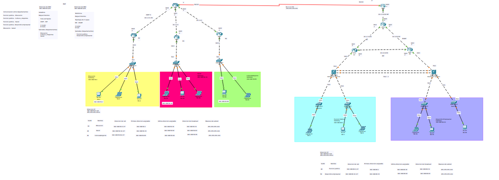

### Universidad de San Carlos de Guatemala

### Facultad de Ingeniería

### Escuela de Ciencias y Sistemas

## Practica 2

<div>
    <p align="center">
        
  <p>
</div>

## Curso: Redes de Computadoras 2

<hr>
<br>
<div>
    <table>
        <tr>
            <th>Nombre</th>
            <th>Carnet</th>
        </tr>
        <tr>
            <th>Juan Antonio Solares Samayoa</th>
            <th>201800496</th>
        </tr>
        <tr>
            <th>Elmer Gustavo Sánchez García</th>
            <th>201801351</th>
        </tr>
        <tr>
            <th>Cristian Alexander Gómez Guzmán</th>
            <th>201801480</th>
        </tr>
    </table>
</div>
<br>
<hr>

# Topología



# EXPLICACIÓN SUBREDES

La técnica para dividir la topología en subredes fue VLSM (Variable Length Subnet Mask), la cual fue elegida debido las siguientes razones:

- Permite dividir un espacio de red en partes desiguales
- La mascara de subred varía de acuerdo a la cantidad de bits que se toman prestados para una subred específica
- La red primero es dividida en subredes y las subredes son divididas en más subredes.

## Tabla de subredes

### Vodafone

| **VLAN** |   **Nombre**    | **Dirección de red** | **Primera dirección asignable** | **Ultima dirección asgnable** | **Dirección de broadcast** | **Mascara de subred** |
| :------: | :-------------: | :------------------: | :-----------------------------: | :---------------------------: | :------------------------: | :-------------------: |
|    19    |    Educación    |   192.168.59.0/27    |          192.168.59.1           |         192.168.59.30         |       192.168.59.31        |    255.255.255.224    |
|    29    |      Salud      |   192.168.59.32/27   |          192.168.59.33          |         192.168.59.62         |       192.168.59.63        |    255.255.255.224    |
|    39    | Cultura&Deporte |   192.168.59.64/24   |          192.168.59.65          |         192.168.59.94         |       192.168.59.95        |    255.255.255.224    |

### Telefónica

| **VLAN** |       **Nombre**       | **Dirección de red** | **Primera dirección asignable** | **Ultima dirección asgnable** | **Dirección de broadcast** | **Mascara de subred** |
| :------: | :--------------------: | :------------------: | :-----------------------------: | :---------------------------: | :------------------------: | :-------------------: |
|    49    |    Función pública     |   192.168.99.0/27    |          192.168.99.1           |         192.168.99.30         |       192.168.99.31        |    255.255.255.224    |
|    59    | Desarrollo empresarial |   192.168.99.32/27   |          192.168.99.33          |         192.168.99.62         |       192.168.99.63        |    255.255.255.224    |

# Comandos utilizados para realizar la práctica

# Vodafone

# Configuración de ip

```console
# R1
conf t
int G0/0
ip address 10.1.2.1 255.255.255.252
no shutdown
exit

int G0/1
ip address 10.1.3.1 255.255.255.252
no shutdown
exit

int G0/2
ip address 10.1.4.1 255.255.255.252
no shutdown
exit

int S0/3/0
ip address 10.1.1.1 255.255.255.252
no shutdown
exit

# R2

conf t
int G0/0
ip address 10.1.2.2 255.255.255.252
no shutdown
exit

int G0/1
ip address 192.168.59.1 255.255.255.224
no shutdown
exit


# R3
conf t
int g0/0
ip address 10.1.3.2 255.255.255.252
no shutdown
exit

int g0/1
ip address 192.168.59.33 255.255.255.224
no shutdown
exit

# R4
conf t
int g0/0
ip address 10.1.4.2 255.255.255.252
no shutdown
exit

int g0/1
ip address 192.168.59.65 255.255.255.224
no shutdown
exit

```

# Aplicando protocolos de enrutamiento

# R1 - OSPF

```console
    router osfp 100
    network 192.168.59.0 0.0.0.31 area 0
    network 10.1.2.0 0.0.0.3 area 0
    end
    wr
```

# R3 - OSPF

```console
    router osfp 200
    network 192.168.59.33 0.0.0.31 area 0
    network 10.1.3.0 0.0.0.3 area 0
    end
    wr
```

# R4 - RIP

```console
    router rip
    no auto-summary
    network 192.168.59.65
    network 10.1.4.0

```

# R1 - OSPF - RIP

```console
    router osfp 100
    network 10.1.2.0 0.0.0.3 area 0
    exit

    router osfp 200
    network 10.1.3.0 0.0.0.3 area 0

    router rip
    no auto-summary
    network 10.1.4.0

```

## R1 REDISTRIBUCION

```console
    config t

    router ospf 100
    redistribute rip subnets
    exit

    router ospf 200
    redistribute rip subnets
    exit

    router rip
    redistribute ospf 100 metric 15
    redistribute ospf 200 metric 15
```

# Telefonica

## Configuración de ip

```console

# R5

conf t
int G0/0
ip address 10.1.5.1 255.255.255.252
no shutdown
exit

# R6

conf t
int G0/0
ip address 10.1.5.2 255.255.255.252
no shutdown
exit

int G0/1
ip address 10.1.7.1 255.255.255.252
no shutdown
exit

int G0/2
ip address 10.1.8.2 255.255.255.252
no shutdown
exit

# R7

conf t
int G0/0
ip address 10.1.6.1 255.255.255.252
no shutdown
exit

int G0/1
ip address 10.1.7.2 255.255.255.252
no shutdown
exit

int G0/2
ip address 192.168.99.1 255.255.255.224
no shutdown
exit

# R8

conf t
int G0/0
ip address 10.1.6.2 255.255.255.252
no shutdown
exit

int G0/1
ip address 192.168.99.33 255.255.255.224
no shutdown
exit

int G0/2
ip address 10.1.8.1 255.255.255.252
no shutdown
exit
```

# Aplicando protocolos de enrutamiento

# 5 RIP

```console
    router rip
    no auto-summary
    network 10.1.5.0
```

# 6 RIP - EIGRP

```console

    router rip
    no auto-summary
    network 10.1.7.0
    exit

    router eigrp 100
    network 10.1.8.0 0.0.0.3
    no auto-summary
```

# 7 RIP

```console

    router rip
    no auto-summary
    network 192.168.99.0
    network 10.1.7.0
    network 10.1.6.0
```

# 8 RIP - EIGRP

```console
    router rip
    no auto-summary
    network 10.1.6.0
    network 192.168.99.32
    exit

    router eigrp 100
    network 10.1.8.0 0.0.0.3
    no auto-summary
```

## R8 REDISTRIBUCION

```console
    config t

    router eigrp 100
    Redistribute rip metric 10000 100 255 1 1500
    exit
    router rip
    redistribute eigrp 100 metric 15
    exit
```


## CONFIGURACION DE BGP
``sh
    
    # Wodafone
    config t
    router ospf 100
    network 10.1.2.0 0.0.0.3 area 0
    exit

    router bgp 100
    network 10.1.1.0 mask 255.255.255.252


    # Telefonica
    config t
    router rip 
    network 10.1.5.0

    router bgp 200
    network 10.1.1.0 mask 255.255.255.252


    # Configurar vecinos en Wodafone
    configure terminal
    router bgp 100
    neighbor 10.1.1.2 remote-as 200

    # Configurar vecinos en Telefonica
    configure terminal
    router bgp 200
    neighbor 10.1.1.1 remote-as 100
 

    # Redistribuir BGP en Wodafone
    router ospf 100
    redistribute bgp 200 metric 1 1 1 1 1


    # Redistribuir BGP en Telefonica
    router rip 
    redistribute bgp 100 metric 1 1 1 1 1


``


# Comunicación entre departamentos:

| Departamento    | Departamento           |
| --------------- | ---------------------- |
| Función Pública | Educación              |
| Función Pública | Cultura y Deportes     |
| Función Pública | Salud                  |
| Función Pública | Desarrollo Empresarial |
| Educación       | Salud                  |

## Educacion

```console
conf t
access-list 2 permit 192.168.59.32 0.0.0.31
access-list 2 permit 192.168.99.0 0.0.0.31
access-list 2 deny 192.168.59.64 0.0.0.31
access-list 2 deny 192.168.99.32 0.0.0.31

interface g0/1
ip access-group 2 out
```

## Salud

```console
conf t
access-list 2 permit 192.168.99.0 0.0.0.31
access-list 2 permit 192.168.59.0 0.0.0.31
access-list 2 deny 192.168.59.64 0.0.0.31
access-list 2 deny 192.168.99.32 0.0.0.31

interface g0/1
ip access-group 2 out
```

## Cultura y deportes

```console
conf t
access-list 2 permit 192.168.99.0 0.0.0.31
access-list 2 deny 192.168.59.0 0.0.0.31
access-list 2 deny 192.168.59.32 0.0.0.31
access-list 2 deny 192.168.99.32 0.0.0.31

interface g0/1
ip access-group 2 out

```

## Desarrollo empresarial

```console
conf t
access-list 2 permit 192.168.99.0 0.0.0.31
access-list 2 deny 192.168.59.0 0.0.0.31
access-list 2 deny 192.168.59.32 0.0.0.31
access-list 2 deny 192.168.59.64 0.0.0.31

interface g0/1
ip access-group 2 out
```

# Configuracion de IPV6

### R1

```console
config t
ipv6 unicast-routing
ipv6 router ospf 100
router-id 1.1.1.1
exit
int g0/0
ipv6 address abcd:defe:2730:2::1/64
no shutdown
exit
int g0/0
ipv6 ospf 100 area 0
exit
int g0/1
ipv6 address abcd:defe:2730:3::1/64
no shutdown
exit
ipv6 router ospf 100
int g0/1
ipv6 ospf 100 area 0
exit
```

### R2

```console
config t
ipv6 unicast-routing
ipv6 router ospf 100
router-id 2.2.2.2
exit
int g0/0
ipv6 address abcd:defe:2730:2::2/64
no shutdown
exit
int g0/0
ipv6 ospf 100 area 0
exit
int g0/1
ipv6 address abcd:defe:2730:4::1/64
no shutdown
exit
int g0/1
ipv6 ospf 100 area 0
exit

```

### R3

```console
config t
ipv6 unicast-routing
ipv6 router ospf 100
router-id 3.3.3.3
exit
int g0/0
ipv6 address abcd:defe:2730:3::2/64
no shutdown
exit
int g0/0
ipv6 ospf 100 area 0
exit
int g0/1
ipv6 address abcd:defe:2730:5::1/64
no shutdown
exit
int g0/1
ipv6 ospf 100 area 0
```
